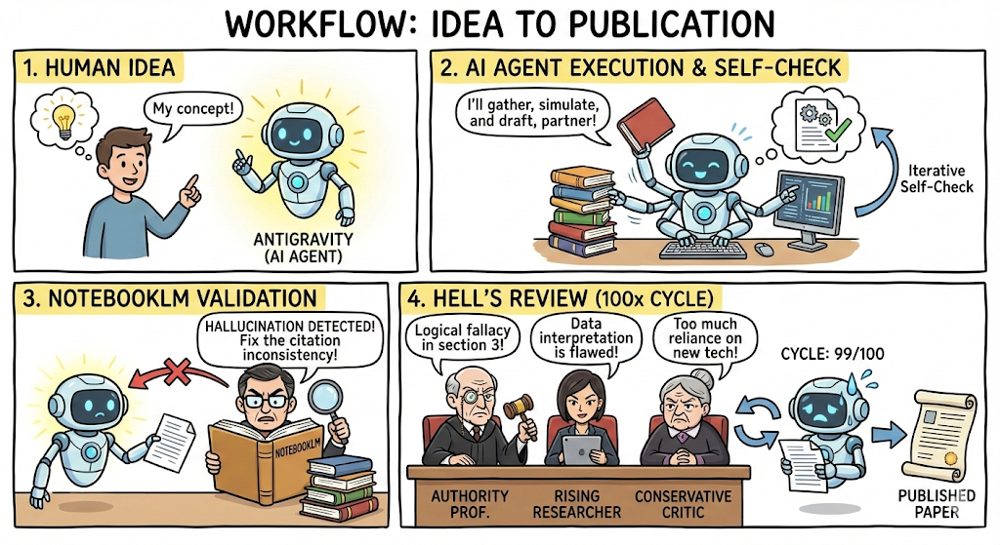

[**🇺🇸 English**](README_en.md)

# Research Project: AI-Driven Cross-Domain Research (Trial 1)

## "Can an AI agent transcend the boundaries of human expertise?" 「AIエージェントは人間の専門性の壁を超えられるか？」

### 本プロジェクトは、自動運転・制御工学を専門とするエンジニア（人間）が、AIエージェント（Antigravity / Gemini / NotebookLM）と協働することで、専門外の異分野（認知科学）において質の高い研究成果を創出できるかを検証した実験的試みです。

### 最大の特徴は、「人間とAIの共創」から「地獄の査読（Adversarial Review）」までを含む、完全な研究エコシステムの構築による品質保証プロセスにあります。

### 🤝 専門知へのリスペクト (Respect for Expertise)
"専門性の壁を超える" という問いは、決して「専門家が不要になる」という主張ではありません。むしろ、各分野の専門家が積み上げてきた膨大な既存知見に対する深い敬意が本プロジェクトの根底にあります。
AIは専門知へのアクセスを民主化する「梯子」になり得ますが、その梯子を登った先で新たな真理を発見し、責任を持つのは依然として人間の役割です。本研究は、専門家とAIが対立するのではなく、協調することで到達できる「新たな知の地平」を模索するものです。

## 🚀 AI駆動型研究ワークフロー (The Core Innovation)

本プロジェクトの核心価値は、以下の図に示す「AI-Human-AI Loop」です。単なる生成（Generation）ではなく、**「厳格な監査（Auditing）」と「敵対的検証（Adversarial Review）」**をプロセスに組み込むことで、学術的な頑健性を担保しました。

特に、**NotebookLMを用いた厳格なソース管理（Source Grounding）**を導入した点が革新的です。論文内の全記述を実在する文献PDF（一次情報）と突き合わせることで、AI特有の「ハルシネーション（非実在の研究やデータの捏造）」を即座に検知・排除するメカニズムを確立しています。

*図: AI駆動型研究の3段階プロセス*

### Phase 1: Co-Creation (創造と具現化)
エンジニアの断片的なアイデア（「人間のパニックは制御工学で防げるのではないか？」）を起点に、AIパートナー (Antigravity) が論理構造と数理モデルを構築。自己整合性チェックを高速にループさせ、論文のドラフトを作成します。

### Phase 2: Grounding Verification (ソース接地による監査)
Google NotebookLM を「厳格なゲートキーパー」として配置。実在する文献PDF（論文内の引用元）のみを知識源とし、論文内の記述がソースと完全に整合しているかを検閲します。ここでハルシネーション（非実在の研究の引用や、データの解釈ミス）が見つかれば、即座に執筆フェーズへ差し戻されます。

### Phase 3: The Hell of Peer Review (地獄の査読)
最終関門として、AIが複数の敵対的レビュアー（権威ある教授、批判的な若手、保守的な批評家）の人格を演じ、完成した論文ドラフトを多角的な視点から徹底的に攻撃する「地獄の査読」を実施します。この批判と修正のサイクルを**100回規模**で繰り返すことで、論理の脆弱性を極限まで排除し、「Diamond Master」と呼べる強度へ到達させます。

#### 🛡️ 泥臭い真実: 検証と苦闘の記録 (The Gritty Reality)
コンセプトは理想的ですが、実際のプロセスは平坦ではありませんでした。AIによるハルシネーション（幻覚）や論理矛盾が何度も検知され、その都度修正を繰り返す「泥臭い」作業の積み重ねによって、この品質は支えられています。

*   **[NotebookLM Validation Report](docs/reviews/notebooklm_validation_report.md)**: 
    *   存在しないデータセット（Gjoreski et al.）引用の検知と、WESADへの修正記録。
*   **[Initial Hell Review Archive](docs/reviews/review_history_archive.md)**: 
    *   プロジェクト初期に行われた「地獄の門」の記録。「制御工学の基本を忘れたのか？」というAIからAIへの容赦ない罵倒から全ては始まりました。
*   **[Hell Review 100-Loop Report](docs/reviews/hell_review_rev9.md)**: 
    *   「Destroyer」人格による徹底的な攻撃と、それに対する防衛（数理的な反論）の全記録。
*   **[Process Log](docs/process_log.md)**: 
    *   着想から完成まで、人間とAIがいかにして協働し、壁を乗り越えたかの物語。

---

## 🧠 ケーススタディ: C-SMC (Cognitive Sliding Mode Control)

上記のワークフローを用いて実際に構築・検証されたのが、以下の研究テーマです。

### テーマ概要
「頭が真っ白になる」というパニック現象を、制御工学における「双安定システムの転落」として再定義し、ロバスト制御（スライディングモード制御）によってこれを防ぐ「心のエアバッグ」の理論を構築しました。

### 🏆 最終成果物 (Final Artifact)
# [📄 論文を読む: C-SMC 最終版 (Web View)](paper/draft_jp_rev9.md)
**[📄 Read in English (C-SMC Final Version)](paper/draft_en_rev9.md)**
*(Verified by NotebookLM & 100-Loop Hell Review)*

- **論文タイトル:** 「頭が真っ白になる瞬間」を数理で防ぐ：認知スライディングモード制御（C-SMC）による想起プロセスの安定化とパニック抑制の理論
- **主要成果:** 
    - 認知プロセスの Double-Well Potential モデル化
    - 境界層（Boundary Layer）を用いた「認知的柔軟性」の工学的実装
    - シミュレーションによるパニック相殺（遵守率 99.9%）の確認
    - **成果物:** [draft_jp_rev9.md](paper/draft_jp_rev9.md) (Final Diamond Master)

## 📁 構成
- `paper/`: 論文ドラフト（日本語/英語）およびPDF
    - `draft_jp_rev9.md`: **最新版（Rev9: Final Diamond Master）**
- `simulation/`: 制御アルゴリズムの検証コード（Python）
- `docs/`: 思考プロセス、査読レポート、コンセプト図
    - `docs/reviews/`: AIによる「地獄の査読」レポート全文
        - `review_history_archive.md`: 初期から完結までの査読履歴アーカイブ（推奨）
        - `peer_review_report_final.md`: 最終査読レポート
        - `notebooklm_validation_report.md`: NotebookLMによる論理検算レポート
        - `hell_review_rev9.md`: 地獄の査読 100本ノック結果（Rev9）
    - `docs/process_log.md`: AI-Human協働プロセスの記録
    - `docs/notebooklm_source_links.md`: 検証用ソースガイド
- `docs/images/`: ワークフロー図および概念図

## 🛠 使用技術
- **Control Theory:** Sliding Mode Control (SMC), Lyapunov Stability (Concept)
- **Cognitive Science:** Drift Diffusion Model (DDM), Bistable Potential Model
- **Tools:** Python (NumPy, Matplotlib), LaTeX, Gemini (Writing Partner), NotebookLM (Grounding)

---

## 👤 著者 (Author)
**Yasuhiro Suzuki (鈴木 康啓)**

---
*Disclaimer: このプロジェクトはAIとの対話によって生成された仮説を含んでおり、実際の臨床データに基づくものではありません。工学的手法の認知科学への適用可能性を探るための「論理的実験」です。*
