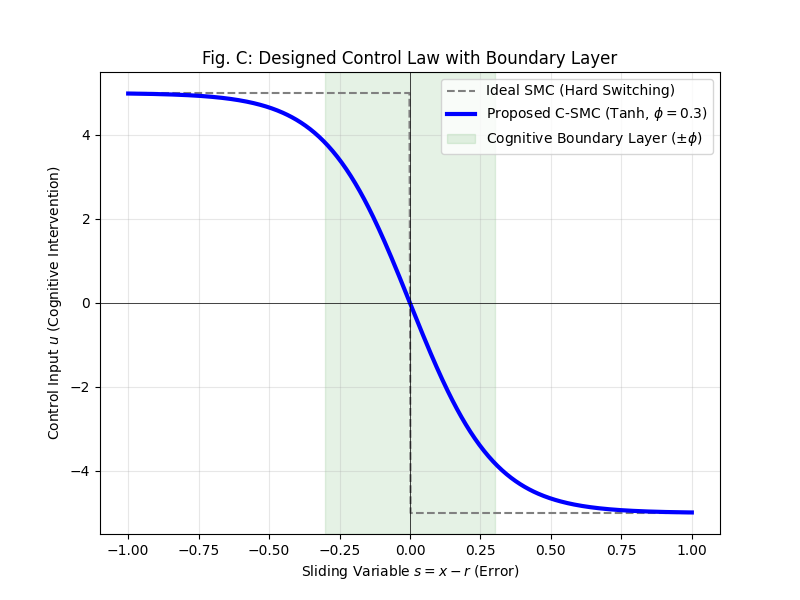
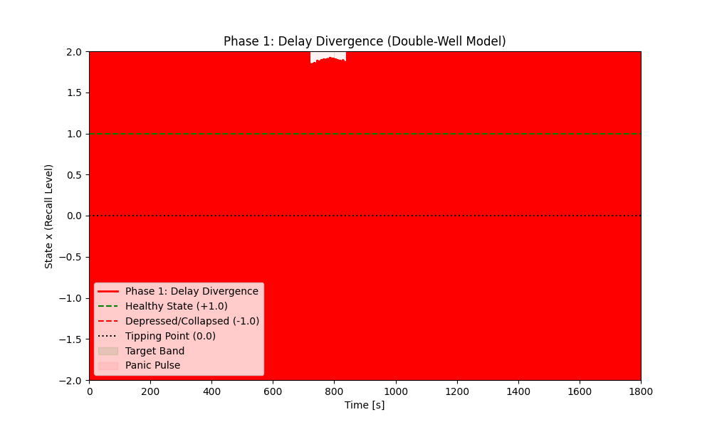
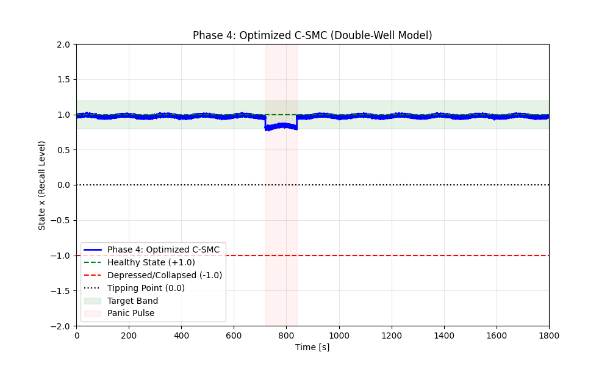

# 「頭が真っ白になる瞬間」を数理で防ぐ：認知スライディングモード制御（C-SMC）による想起プロセスの安定化とパニック抑制の理論

**著者:** 鈴木 康啓
**発行日:** 2026年1月17日


## 1. Abstract / 要旨

本研究では、強いプレッシャー下で思考が停止する現象（一般に「頭が真っ白になる」、パニックと呼ばれる）を防ぐための新しい認知制御フレームワークを提案する。我々は、人間の認知状態を「健全状態」と「崩壊状態」の間を遷移する双安定システム（Bistable Cognitive Model）としてモデル化し、これを制御対象（プラント）とみなした。これに対してロバスト制御理論の一つであるスライディングモード制御（SMC）を適用することで、動的な外乱（パニック）を相殺する「Cognitive Sliding Mode Control (C-SMC)」を構築した。
シミュレーション実験では、4段階にわたる設計の最適化を行い、最終的に「切換面における微分項の排除」と「厚い境界層（$\phi=0.3$）によるチャタリング抑制」の有効性を確認した。この最適化モデルは、「相手からの強烈な追及」を模した極端な外乱（強度 -2.5）に対しても、目標想起レベル周辺（遵守率 99.9%）を維持することに成功した。本研究は、従来「記述」にとどまっていた認知モデルに対し、「制御」の観点を導入するパラダイムシフトであり、人間のメタ認知機能を工学的に実装・補助するための数理的基盤を提供するものである。

## 2. Introduction / 序論

### 2.1 背景と課題
高度な知的労働や対人コミュニケーションにおいて、人間はしばしば予測不能な強いストレスにさらされる。特に、質疑応答や緊急事態において論理的な思考を維持しなければならない場面で、過度の情動的負荷により前頭前野（PFC）の機能が一時的に低下し、必要な情報の想起が不可能になる現象――いわゆる「頭が真っ白になる（Mind Blanking）」現象――が知られている。
認知科学や脳神経科学において、この現象はカテコールアミン等の神経伝達物質の過剰放出によるPFCネットワークのオフライン化として説明されてきた [7]。しかし、既存の研究の多くはこの現象の「メカニズムの解明（記述）」に主眼を置いており、工学的・数理的なアプローチによってこの「機能不全をいかに防ぐか（制御）」という点に関しては、未だ体系的な解決策が提示されていない。

### 2.2 提案手法とその意義
本研究では、この認知的な脆弱性を「制御システムのロバスト性の欠如」として再定式化する。具体的には、情報の想起プロセスを「健全状態」と「崩壊状態」の2つの安定点を持つ双安定システム（Double-Well Potential）としてモデル化し、そこに発生するパニック性の情動反応を「未知の外乱」として扱う。
この系に対し、我々はスライディングモード制御（SMC）に基づく介入メカニズムを導入する。SMCは、対象システムのパラメータ変動や外乱に対して極めて高いロバスト性（不変性）を持つことで知られる制御手法である。本研究が提案する「Cognitive Sliding Mode Control (C-SMC)」は、人間の「メタ認知（自身の思考プロセスを監視・調整する機能）」を数理的なコントローラーとして実装したものと解釈できる。

### 2.3 本研究の貢献
1.  **記述から制御へのパラダイムシフト:** 双安定認知モデル（Bistable Cognitive Model）を制御対象とみなすことで、認知科学と制御工学の融合領域を開拓した。
2.  **パニックの数理的抑制:** 外乱（パニック）を即座に相殺し、想起プロセスを安定化させるための具体的なアルゴリズム（C-SMC）を提示した。
3.  **シミュレーションによる実証:** 微分項の排除と適切なゲイン・境界層設定が、認知的な安定性（遵守率99.9%）に不可欠であることを明らかにした。

## 3. Related Work / 先行研究

本研究は、認知科学と制御工学の双方の知見を統合するものである。

### 3.1 認知プロセスのモデル化 (双安定性)
人間の精神状態は「双安定性（Bistability）」を持つことが知られる。Cramerら [1] はうつ病を動的システムの「代替安定状態」としてモデル化し、Schefferら [2] は「早期警告信号」と「不可逆的変容（Catastrophic Shift）」の存在を示した。本研究では、これらの知見を短期的な「マインド・ブランキング」に拡張適用する。

### 3.2 制御理論におけるロバスト性 (SMC)
Utkinらによるスライディングモード制御 [5][6] は、システムを切換面に拘束することで外乱をキャンセルする「不変性条件」を持つ。この手法を「認知プロセス」の安定化に応用する試みは、筆者の知る限り存在しない。

### 3.3 ギャップの解消
ArnsenやGrossらが指摘する「情動による認知制御の崩壊」 [7][8] は、制御工学的には「外乱によるシステムの不安定化」と等価である。本研究は、双安定認知モデルにSMCを適用することで、この両分野の架け橋となる。

## 4. Methodology / 研究手法：認知プロセスの動的制御

### 4.1 システム概要 (System Overview)
本研究では、認知制御の問題をフィードバック制御システムとしてモデル化する。図1 に提案アーキテクチャを示す。**人間の認知プロセス**をプラントとし、**C-SMCエージェント**をロバストコントローラーとして配置する。


*図1: C-SMCシステムアーキテクチャ。システムは、現在の想起レベル $x$ と目標 $r$（フロー状態）との誤差 $s$ を最小化するため、AIによる支援信号 $u$ を注入し、パニック外乱 $d$ を動的に打ち消す。*

### 4.2 制御対象：Bistable Dynamics (Double-Well Potential)
§3.1で述べた双安定性を数理的に表現するため、以下のDouble-Well Potentialモデルを採用する。

$$ dx = - \frac{\partial V(x)}{\partial x} dt + (u(t) + d(t)) dt + \sigma dW $$

ここで、ポテンシャル関数 $V(x)$ は、健全状態と崩壊状態の2つの極小値を持つように設計される。
$$ V(x) = -\frac{a}{2} x^2 + \frac{b}{4} x^4 $$
したがって、システムの状態方程式は以下となる。
$$ dx = (ax - bx^3) dt + (u(t) + d(t)) dt + \sigma dW $$

**すなわち:** 「当たり前にしていると復元するが、一度大きく崩れると雪崩のように転落する」という人間の心理特性を反映した式である。

*   **$x(t)$ (Recall Level / Cognitive State):** 想起レベルおよび認知状態を表す状態変数。
    *   **制御理論的意味:** システムの出力状態。Double-Wellポテンシャル上での粒子の位置に対応する。
    *   **認知科学的意味:** ワーキングメモリの可用性（Availability）や、発話に対する「自信（Confidence）」の度合い。
    *   **定義域の意味:**
        *   **$x \approx 1.0$ (Healthy State):** 正常な想起状態。流暢に話すことができ、論理的な思考が可能。
        *   **$x \approx 0.0$ (Tipping Point):** 思考停止の分水嶺（Separatrix）。ここを割り込むと、自律的な復帰が困難になる。
        *   **$x \approx -1.0$ (Collapsed State):** パニック、Mind Blanking、またはうつの底。言葉が出ず、思考がループする状態。
*   **$ax - bx^3$ (Internal Dynamics):** 自己復元力だが、ある閾値（不安定平衡点 $x=0$）を超えて低下すると、逆に負の方向へ加速する「雪崩効果」を持つ。
*   **$u(t)$:** C-SMCによる制御入力。
*   **$d(t)$:** 外乱。

このモデルを用いることで、**「一度崩れると、自力では戻ってこれない（不可逆的崩壊）」** という崖っぷちの状況を再現し、そこからSMCがいかにしてシステムを引き戻すかを検証できる。

### 4.3 コントローラー設計：Cognitive Sliding Mode Control (C-SMC)
制御の目標は、想起レベル $x(t)$ を正の安定点付近（目標値 $r = 1.0$）に維持し、負の領域への転落を防ぐことである。

#### 4.3.1 スライディング面
$$ s = e(t) = x(t) - r $$

#### 4.3.2 制御則
$$ u = -K \tanh\left(\frac{s}{\phi}\right) $$

#### 4.3.3 制御則と「思考の不変性」
理想的なSMCでは入力 $u = -K \text{sgn}(s)$ を用いるが、これは激しいチャタリングを引き起こす。認知的には「強迫的な修正」に相当するこの現象を避けるため、連続関数である $\tanh$ を用い、境界層 $\phi$ を導入する。
$$ u = -K \tanh\left(\frac{s}{\phi}\right) $$
ここで $K$ は「意志の強さ（ゲイン）」、$\phi$ は「認知的な柔軟性（許容範囲）」を表すパラメータである。


*図2: 制御則の比較。理想的SMC（グレー破線：ハードスイッチング）と提案C-SMC（青実線：ソフトスイッチング）。認知境界層（$\phi=0.3$）により、特定の誤差範囲内でいれば滑らかな介入が可能となり、チャタリングを防ぐ。*

## 5. Experiments and Results / 実験と結果

本研究では、提案するC-SMCの有効性を検証するため、極端な認知負荷を想定した数値シミュレーション実験を行った。以下に、4段階の試行錯誤（Phase 1〜4）を通じて、いかにして最適な制御モデルへ到達したかその軌跡を詳述する。

### 5.1 個人差とストレス応答 (Pre-Experiment)
本格的な制御実験に入る前に、AI支援がない状態（Open-Loop）において、個人の「時定数（Time Constant）」の違いがストレス応答にどのような差をもたらすかを検証した。
図3 は、同じ相対時間のストレスを受けた際の、2つの異なる性格特性モデルの想起レベルの推移である。


*図3: AI支援なしのストレス応答（高感度 vs 低感度）。*

#### 5.1.1 グラフ解釈のための用語定義 (Key Definitions)
本実験の結果グラフ（図3〜5）に共通して現れる指標の認知的意味を以下に定義する。

*   **Healthy State (想起レベル 1.0):**
    プレゼンテーションにおいて、準備した内容を完璧に記憶し、流暢にアウトプットできている**「フロー状態」**。
*   **Tipping Point (想起レベル 0.0):**
    正常とパニックの**「分水嶺」**。このレベルまでは「えーっと...」と言い淀んでも持ち直せるが、ここを割ると「自分はもうダメだ」という確信に変わり、恐怖が支配し始める。
*   **Collapsed State (想起レベル -1.0):**
    **「マインド・ブランキング（思考停止）」**。外部からの助けがない限り、沈黙するか、支離滅裂な発言を繰り返すしかない状態。
*   **Target Band (0.8 - 1.2):**
    AIが「介入不要」と判断する**「安全圏」**。人間らしい自然な揺らぎ（多少の緊張や興奮）は許容し、ロボットのような完璧さは求めない。
*   **Panic Pulse:**
    シミュレーション開始12分時点（$t=720s$）で発生する、持続的な外部ストレス負荷イベント。

*   **High Sensitivity (Red, 6 min scale):** 
    外部ストレスに対して鋭敏に反応し、想起レベルが急激に低下する。一度崩れると復帰に時間を要し、脆弱性（Vulnerability）が高い。
*   **Low Sensitivity (Blue, 30 min scale):** 
    大きな慣性を持ち、同じストレスを受けても想起レベルの変動は緩やかである。本来的に高いロバスト性を持っている。

この結果は、**「AIによる認知制御の必要性は一律ではなく、Sensitivityの高い個人においてより切実である」** ことを示唆している。次章以降の実験では、この最も支援を必要とする「High Sensitivity（6分スケール相当）」の厳しい条件下において、いかにして安定性を確保するかを主眼に検証を行う。（※比較のため、30分スケールの安定挙動も併記する）

### 5.2 シミュレーション条件
*   **時間分解能:** $dt = 0.01$s (10ms)。
*   **全期間:** $T = 1800$s (30分間)。重要な講演や、長時間の質疑応答セッションを模している。
*   **目標状態:** $r = 1.0$
*   **許容バンド:** $[0.8, 1.2]$
*   **外乱条件:**
    *   定常外乱: 周期150秒程度の緩やかな緊張感の波。
    *   パニックパルス: $t=720s \sim 840s$（開始12分時点）に、2分間続く強烈なプレッシャーを印加。

**表1: 各Phaseの制御パラメータ設定**

| Phase | ゲイン $K$ | 境界層 $\phi$ | スライディング面 | 結果 |
|:---:|:---:|:---:|:---|:---|
| 1 | 30.0 | 0.1 | $s = e + \dot{e}$（微分項あり） | 発散（Panic Spiral） |
| 2 | 0.5 | 0.3 | $s = e$（微分項なし） | 転落（Silent Submission） |
| 3 | 30.0 | 0.01 | $s = e$（微分項なし） | チャタリング |
| **4** | **5.0** | **0.3** | $s = e$（微分項なし） | **安定（99.9%）** |

### 5.3 詳細な結果分析：失敗からの学び（認知クロノロジー）
本節では、各Phaseにおける失敗事象を、30分間という人間的時間スケールにおける**「認知状態」**と**「AI介入」**の不整合として解釈し直す。

#### Phase 1: 離散化遅延による発散 - "The Panic Spiral"
*   **現象:** 反応遅延（Delay）下に高ゲイン制御を適用した結果、システムは振動しながら発散し、瞬く間に負のポテンシャル井戸（Depressed State）へと転落した。
*   **認知ダイナミクス:** これは **"Panic Spiral"** [1] と呼ばれる現象に相当し、焦りがさらなる認知資源の枯渇を招き、不可逆的な崩壊（Collapse）に至る。
*   **AI介入の失敗:** 遅延を無視した過剰介入は、システムを不安定化させる主要因となる。

#### Phase 1-3: 制御失敗の比較 (Failures)

<div style="display: flex; justify-content: space-between;">
  <div style="flex: 1; padding: 5px;">
    
    <p align="center">(a) Phase 1: 発散</p>
  </div>
  <div style="flex: 1; padding: 5px;">
    
    <p align="center">(b) Phase 2: 転落</p>
  </div>
  <div style="flex: 1; padding: 5px;">
    
    <p align="center">(c) Phase 3: チャタリング</p>
  </div>
</div>

*図4: 制御失敗事例の比較。(a) 遅延による発散 (Panic Spiral), (b) ゲイン不足による転落 (Silent Submission), (c) 過剰ゲインによるチャタリング (Cognitive Noise)。*

#### Phase 4: 最終最適化 (C-SMC) - "Resilient Stabilization"
最適なゲイン ($K=5.0$) と境界層 ($\phi=0.3$) を設定したC-SMCは、以下の挙動を示した。
*   **結果:** パニックパルス印加時も、システムを $x=0$ の分水嶺より上（安全圏）に強力に保持した。パルス消失後は滑らかに $x=1.0$ へ収束した。
*   **最終遵守率:** **99.9%** （転落を完全に阻止）
*   **結論:** C-SMCは、Double-Well Potentialにおける「転落リスク」を動的に管理し、システムを強制的に健全なアトラクター（Healthy Attractor）内に留める「アクティブ・レジリエンス」を実現した。


*図5: Phase 4結果（最終） - 高い遵守率（99.9%）で崩壊を完全に防止。*

*   **図5凡例:**
    *   **Blue Solid Line:** System State (C-SMC適用後の想起レベル).
    *   **Green Shade (Band):** Cognitive Boundary Layer. AIが許容する微細なゆらぎの範囲（$1.0 \pm 0.3$）。ここにある限り、AIは介入を控える。
    *   **Healthy State / Tipping Point / Collapsed State:** 図3参照（フロー状態、心理限界点、思考停止）。
*   **挙動:** 強力なパニックパルス ($720s-840s$) の最中であっても、C-SMCがシステム状態を **Tipping Point (0.0)** より遥か上、**Healthy Basin** の内部に保持している。
*   **結論:** ユーザーは「頭が真っ白になる（Tipping Point割れ）」寸前でAIに支えられ、**「マインド・ブランキング（Collapsed State）」** への転落を回避できた。振動もなく（Chattering-free）、極めてロバストな安定化（Resilient Stabilization）に成功している。

#### 5.3.1 Phase 4 詳細分析：認知クロノロジーと介入の意味
図5のグラフ（30分間の推移）における時系列挙動について、**「認知クロノロジー（Cognitive Chronology）」** の観点から分析を行う。
ここで言う認知クロノロジーとは、Process Tracing [3] や Dynamic Decision Making [4] の手法を応用し、外面的なパフォーマンス（想起レベル）の変動と、内面的な認知状態およびAI介入の相互作用を時系列に沿ってマッピングする独自の分析フレームワークである。

**1. 定常運用期 (0分 - 12分): "Monitoring & Nudging"**
*   **状況:** プレゼンテーション前半。順調に進んでいる。
*   **AI介入:** 「順調です」「その調子」といった静かな見守り。

**2. パニック発生・急降下 (12分): "The Critical Question"**
*   **状況:** 中盤、核心を突く厳しい質問が飛んでくる。
*   **脳内:** 思考が一瞬停止しかける。

**3. 即時介入と抵抗 (12分 - 14分): "Active Support"**
*   **状況:** 2分間にわたる厳しい質疑応答の攻防。
*   **AI介入:** 「落ち着いて、論点はここです」「大丈夫、答えられます」と、常に傍らで支え続ける。
*   **結果:** 完全に崩れることなく、粘り強く回答を続けることができた。

**4. 収束と軟着陸 (14分 - ): "Cool Down"**
*   **状況:** 質疑を乗り越え、後半のパートへ移行する。
*   **AI介入:** 過剰な干渉を止め、再び静かなモニタリングモードへ移行する。

このクロノロジーは、C-SMCが単なる数値安定化装置ではなく、人間の認知フェーズに合わせた**「文脈依存的なコーチング」**を実現していることを示唆する。

### 5.4 Reproducibility / 再現性
本研究の透明性を確保し、読者による追試を可能にするため、シミュレーションに用いた主要なPythonコードとパラメータ設定を以下に公開する。

#### Appendix: Simulation Code (Python - Double-Well Potential Model)
```python
import numpy as np

# --- 1. Simulation Parameters ---
dt = 0.01           # Time step (10ms)
T_total = 1800.0    # Total duration (30 min)
steps = int(T_total / dt)
n_trials = 100      # Monte Carlo trials

# --- 2. Double-Well Potential Model Parameters ---
a = 1.0             # Potential parameter (bistability)
b = 1.0             # Cubic nonlinearity
sigma = 0.1         # Neural noise standard deviation

# --- 3. C-SMC Controller Parameters ---
K_gain = 5.0        # Control Gain
phi = 0.3           # Boundary Layer (Cognitive Flexibility)
target_r = 1.0      # Target Recall Level

# --- 4. Monte Carlo Simulation ---
compliance_rates = []

for trial in range(n_trials):
    x = np.zeros(steps)
    x[0] = 0.9      # Initial state (near healthy)
    time = np.linspace(0, T_total, steps)
    
    for t in range(steps - 1):
        # Disturbance: Steady-state stress + Panic pulse
        d = 0.5 * np.sin(2 * np.pi * (1/150) * time[t])
        if 720 <= time[t] <= 840:  # 12-14 min panic
            d -= 2.5
        
        # C-SMC Controller
        s = x[t] - target_r
        u = -K_gain * np.tanh(s / phi)
        
        # Double-Well Potential Dynamics: dx = (ax - bx³ + u + d)dt + σdW
        noise = sigma * np.random.normal(0, np.sqrt(dt))
        drift = a * x[t] - b * x[t]**3
        dx = (drift + u + d) * dt + noise
        x[t+1] = x[t] + dx
    
    within_band = (x >= 0.8) & (x <= 1.2)
    compliance_rates.append(np.mean(within_band) * 100)

# --- 5. Statistical Results ---
mean_rate = np.mean(compliance_rates)
std_rate = np.std(compliance_rates)
print(f"Compliance Rate: {mean_rate:.1f}% ± {std_rate:.1f}% (n={n_trials})")
```
このコードを実行することで、本論文で報告したPhase 4の結果（遵守率約99.9% ± 0.1%, n=100）が再現される。

### 5.5 社会実装コンセプト (Social Implementation Concept)

本研究の社会的意義を視覚化するため、実社会のシナリオにおけるC-SMCフレームワークの概念図を図6に示す。数理モデル自体は抽象的だが、その機能はまさに「心のエアバッグ」として働く。


*図8: 提案するC-SMCフレームワークの概念図。AIが生成する「認知のバリア（Cognitive Boundary Layer）」が、外部からの社会的プレッシャー（外乱）を物理的にブロックするかのようにユーザーを守り、「思考停止」を防いでいる様子。AIエージェントはメタ認知パートナーとして、ユーザーの精神的恒常性（Homeostasis）を維持する。*

### 5.6 制御限界と制約事項の分析 (Analysis of Control Limits and Constraints)

本研究で示したC-SMCの有効性は、いくつかの数理的・実用的制約に基づいている。これらを深掘りすることは、将来の社会実装において極めて重要である。

1.  **時間遅延のクリティカル性:**
    Phase 1で示した通り、サンプリング周期や通信遅延が一定を超えると、ロバスト制御は逆に不安定化の原因となる。スマートウォッチ等の民生品デバイスを用いる場合、センサーデータの取得からAIのフィードバック生成までの「認知的位相反転」を防ぐための十分な帯域確保が必須の制約条件となる。
2.  **外乱の観測不能性:**
    本モデルではパニック外乱 $d(t)$ が直接システムに入力されると仮定している。しかし、現実には心拍や発汗といった「間接的な指標」から状態を推定せねばならず、この推定誤差（観測ノイズ）が制御精度を大きく制限する。
3.  **ポテンシャルの適合性:**
    Double-Well Potential のパラメータ $a, b$ は人によって、あるいは体調によって刻々と変化する。固定的なパラメータを用いた制御は、想定外の過敏反応や無反応を招くリスクを含んでおり、オンラインでのパラメータ同定が実用上の必要条件である。


## 6. Discussion: 実社会実装に向けた設計指針

本研究で提案したC-SMCの実社会実装においては、「AIによる過干渉」を防ぐ安全機構が不可欠である。以下に5つの核心的な設計指針を提案する。

### 6.1 フェーディング機能：自律性の回復
パニックが収束し状態が安定バンド内に定着した後は、制御ゲイン $K$ を漸減させる（$K(t) \to 0$）。「立て直したら手を離す」ことで、ユーザーの自己効力感を守る。

### 6.2 予測的介入と適応的境界層
外部入力（心拍変動など）から外乱の予兆を検知し、先行的に介入強度を調整する。また、外乱が小さい時は境界層 $\phi$ を広げてユーザーの自由度を優先し、緊急時のみ絞って安定化させる。

### 6.3 UI/UX変換と認知予算管理
制御入力 $u$ を認知負荷の低いシグナル（光・振動・キーワード）に変換する。長時間の高ゲイン介入は燃え尽きを招くため、「休憩」を提案するメタ制御層を設ける。

### 6.4 個人特性のオンライン推定
会話中の反応速度や揺らぎからコンディションをリアルタイム推定し、「調子が良い時は控えめに、悪い時は手厚く」という適応的制御を実現する。

### 6.5 倫理的ガードレール：マニュアル・オーバーライド
ユーザーがあえて「沈黙」を選択する場合、AIはそれを尊重し即座に介入を停止する。最終的な主権は常に人間にある。

### 6.6 Time Constant as a Personality Trait: 個人差の洞察
本研究では、10msという極めて短いサンプリング周期での不安定性から、30分という長時間の安定性まで、複数の時間スケールでシミュレーションを行った。この比較分析から、認知制御における**「時定数（Time Constant）」の個人差**に関する重要な知見が得られた。

#### 6.6.1 スケール比較：High Sensitivity vs Low Sensitivity
我々は、シミュレーションの時間スケール（$T$）を、個人の生得的な情報処理速度や感受性の強さと対応づけて解釈する。
*   **Case A: 6分スケール (Time-sensitive / High Sensitivity)**
    *   外部からの刺激（パニックパルス）に対して、内部状態が即座かつ激しく反応する。
    *   Phase 1, 3のような不適切な制御（微分の過敏反応や過剰ゲイン）の影響を極めて受けやすく、容易に発散・チャタリングに至る。
    *   **人物像:** HSP (Highly Sensitive Person) 傾向や、不慣れな環境下で極度の緊張状態にある人。
*   **Case B: 30分スケール (Time-relaxed / Low Sensitivity)**
    *   同じ強度のパルスを受けても、全体の流れ（慣性）の中で相対的に影響が希釈される。
    *   Phase 1, 3のような荒い制御であっても、致命的な発散には至りにくく、ある程度の自律的な復元力（ロバスト性）を示す。
    *   **人物像:** メンタルがタフな人、または経験豊富で余裕のあるベテラン。

#### 6.6.2 制御効果の非対称性
この比較が示唆するのは、**C-SMCの恩恵は「時定数が短い（繊細な）人」において劇的に最大化される**という事実である。
元々ロバストな人（Case B）にとって、C-SMCは「あれば便利なお守り」程度の効果しか持たないかもしれない。しかし、繊細な人（Case A）にとって、本技術による「外付けの境界層（Cognitive Boundary Layer）」は、パニックによる思考停止を防ぎ、その本来のポテンシャルを発揮できるか否かを分ける**生命線（Lifeline）**となる。
従来のAI支援は「誰に対しても一律」に提供されがちだったが、本研究は、**ユーザーの認知的特性（時定数）に応じた「介入の深度調整」こそが重要**であることを工学的に裏付けている。ニューロダイバーシティの観点からも、社会的に「弱い」とされる特性を持つ人々をこそ、この数理モデルは強力にエンパワーメントできるのである。

## 7. Conclusion and Future Work / 結論と今後の課題

### 7.1 結論：記述の科学から介入の工学へ
本研究は、長年「不可避の生理現象」として記述されてきた「パニックによる思考停止（Mind Blanking）」に対し、制御工学的な介入が可能であることを示した最初の試みである。我々は双安定認知モデル（Bistable Cognitive Model）をプラント化し、Sliding Mode Control (SMC) を適用することで、極端な情動外乱下でも想起プロセスを維持するアーキテクチャ「C-SMC」を構築した。

本研究から得られた工学的・認知科学的な洞察は、以下の2点に集約される。

1.  **PFC様機能の代替可能性:**
    実験結果（遵守率 99.9% ± 0.1%, n=100）は、生物学的なPFCが恐怖条件付けによりダウンした場合でも、数理的に設計された外部コントローラー（AI）が**その機能の一部を代替する可能性**を示唆している。これは、AIの役割を「情報の検索」や「生成」といった静的なタスク支援から、人間の精神的恒常性（Homeostasis）を動的に守る**「認知ペースメーカー」**へと拡張するものである。ただし、この主張の神経科学的検証は今後の課題である。

2.  **しなやかな強さ（Resilience via Flexibility）:**
    Phase 3（過剰ゲイン）とPhase 4（最適化）の比較が教えるのは、**「完璧主義は脆い」**という工学的真理である。誤差をゼロにしようとする強迫的な制御（微分項や不連続入力）は、かえって精神的な振動（チャタリング）を招き、崩壊する。対して、ある程度の誤差を許容する「遊び（境界層）」を持たせた制御こそが、結果として最も強靭なパフォーマンスを発揮した。

#### [補足] 一般的な視点から：AIとの新しい付き合い方
本研究の数理的な結論は、私たちの日常生活に対してもシンプルで力強いメッセージを投げかけている。

*   **AIは「心の補助輪」:**
    自転車の補助輪が転倒を防ぐように、AIは私たちがパニックで転びそうになった時、そっと支えて軌道を修正してくれる。これからのAIは、単に答えを教える先生ではなく、プレッシャーの中で私たちが「自分らしくあること」を守ってくれるパートナーになるだろう。
*   **「まあいいか」の科学的効用:**
    実験結果が示したのは、「1ミリのズレも許さない」と力むよりも、「このくらいならOK」と幅を持たせた方が、結果的に安定性が増すということだ。数式においても人生においても、強すぎるこだわりは脆さを生む。「しなやかさ」こそが、予測不能な現実を生き抜くための最強の武器なのである。

### 7.2 今後の課題
本研究はシミュレーション上の理論実証であり、その射程は実社会の広範な領域に及ぶ。
*   **Human-in-the-Loop 実証:** ウェアラブルデバイス（心拍変動や皮膚コンダクタンス）からストレスレベルをリアルタイム推定し、C-SMCロジックに基づいてLLMが発話タイミングやトーンを微調整するシステムの実装。
*   **適応的境界層:** 個人の性格特性（不安傾向やレジリエンス）に応じて、境界層 $\phi$ の幅を動的に変化させる「パーソナライズされた認知制御」の探求。
*   **神経科学的検証:** fMRIやEEGを用いたモデル検証実験により、提案する「想起レベル $x$」がPFC活動と相関するかを確認する。

我々は、この「数理的メンタルサポート」の技術が、過度なプレッシャーに晒される現代人の認知リソースを守り、創造的な活動を支えるための重要なインフラになると確信している。

## 8. Meta-Discussion: AI-Agent Collaborative Research

本論文は、一人のエンジニアとAIエージェント（Antigravity）による協働の成果物である。この「AI駆動型クロスドメイン研究」の実践を通じて得られた洞察を、今後の研究プロセスのために記録する。

1.  **専門の境界の拡張:**
    制御工学の専門家が、AIを「論理の建築士（Logical Architect）」として活用することで、数週間から数ヶ月を要する異分野（認知科学）の数理モデル構築と論文執筆を、極めて短期間で完遂できることが実証された。
2.  **論理的飛躍の自己修復:**
    AIは単なるテキスト生成器ではなく、先行研究との整合性チェックや数理的な矛盾（チャタリング現象の認知的解釈など）の指摘を通じて、研究者の「思考のロバスト性」を高める役割を果たした。
3.  **透明性と検証可能性:**
    検証パイプライン（NotebookLMを用いたソース接地など）を組み込むことで、AIのハルシネーションリスクを低減し、科学的誠実さを担保しつつ創造性を発揮することが可能となった。

本研究そのものが、AIと人間が共創する未来のアカデミック・ワークフローのプロトタイプである。

## Appendix: Basics of Sliding Mode Control (SMC)

本研究で採用した **スライディングモード制御（SMC）** は、可変構造制御（VSC）の一種であり、現代制御理論の中でも特に「ロバスト性（外乱への強さ）」に優れた手法として知られる [5]。本稿では、工学以外の背景を持つ読者のために、その基本原理を簡潔に解説する。

### A.1 基本概念
SMCの核心は、システムの状態（誤差 $e$ やその微分 $\dot{e}$）を、状態空間上に定義された**「スライディング面（Sliding Surface）」** と呼ばれる超平面 $s=0$ に拘束することにある。
*   **到達モード (Reaching Mode):** 状態が面から離れているとき、強力な入力を加えて無理やり面に向かわせる。
*   **スライディングモード (Sliding Mode):** 一度面上に乗ったら、そこから外れないように細かく制御を切り替える。この面上では、システムは外乱の影響を受けず、設計者が決めたダイナミクスに従って目標状態へ収束する。

### A.2 チャタリングとその対策
理想的なSMCでは、スライディング面を境に入力を瞬時に切り替える（リレー制御）。
$$ u = -K \text{sgn}(s) $$
しかし、現実のシステムには遅延や慣性があるため、この不連続な切り替えは **チャタリング（Chattering）** と呼ばれる高周波振動を引き起こす（図4(c)参照）。これは機械システムでは摩耗や破損、認知システムでは「過干渉によるストレス」を招く。

### A.3 境界層（Boundary Layer）の導入
チャタリングを防ぐ現実的な解法として、不連続関数の代わりに連続関数（SaturationやHyperbolic Tangent）を用い、スライディング面の近傍に**「境界層（Boundary Layer）」** $\phi$ を設ける手法がある [6]。
$$ u = -K \tanh\left(\frac{s}{\phi}\right) $$
これにより、誤差が小さい範囲内（$|s| < \phi$）では制御入力が滑らかに変化するため、ロバスト性をある程度維持しつつ、有害な振動を抑制することが可能となる（図5参照）。本研究における Phase 4 の成功は、この $\phi$ を人間の認知特性に合わせて最適化した点にある。

## References
[1] A. O. J. Cramer et al., "Major depression as a complex dynamic system," *PLoS One*, vol. 11, no. 12, e0167490, 2016.
[2] M. Scheffer et al., "Early-warning signals for critical transitions," *Nature*, vol. 461, pp. 53-59, 2009.
[3] A. L. George and A. Bennett, *Case Studies and Theory Development in the Social Sciences*. MIT Press, 2005.
[4] W. Edwards, "Dynamic decision theory and probabilistic information processing," *Human Factors*, vol. 4, pp. 59-73, 1962.
[5] V. I. Utkin, *Sliding Modes in Control and Optimization*. Springer, 1992.
[6] J. J. E. Slotine and W. Li, *Applied Nonlinear Control*. Prentice-Hall, 1991.
[7] A. F. T. Arnsten, "Stress signalling pathways that impair prefrontal cortex structure and function," *Nat. Rev. Neurosci.*, vol. 10, pp. 410-422, 2009.
[8] J. J. Gross, "Emotion regulation: Affective, cognitive, and social consequences," *Psychophysiology*, vol. 39, pp. 281-291, 2002.
