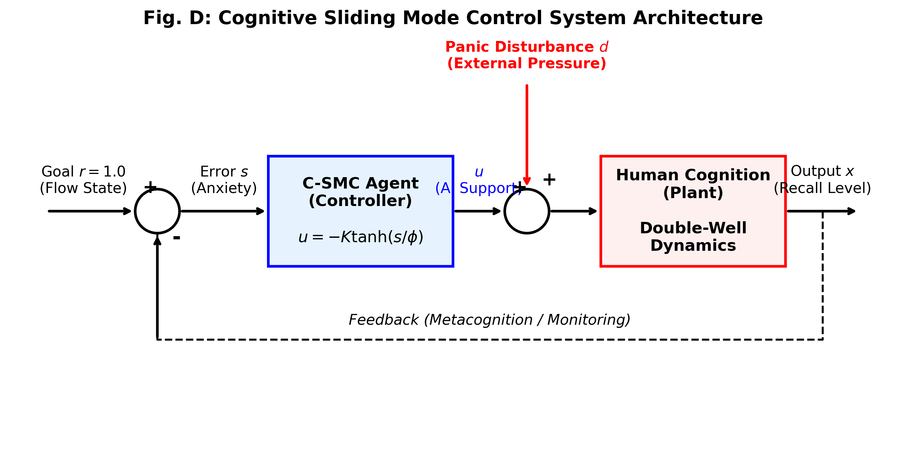
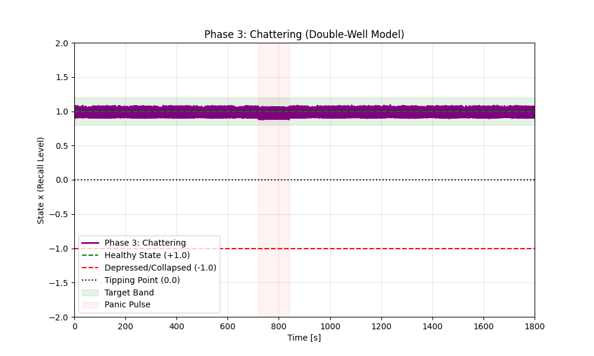

<!-- _class: lead -->

# 「頭が真っ白になる瞬間」を数理で防ぐ
## 認知スライディングモード制御（C-SMC）による 想起プロセスの安定化とパニック抑制

**鈴木 康啓**
2026年1月18日

---

## 1. 序論：背景と課題

### 「頭が真っ白になる (Mind Blanking)」現象
- 重要なプレゼン、口頭試問、緊急時などに発生
- 過度なプレッシャー $\to$ 前頭前野 (PFC) 機能低下 $\to$ 思考停止
- **社会的損失・事故のリスク**

### 従来研究の限界と本研究のアプローチ
- **従来:** 神経科学・心理学による「メカニズム記述」が主
- **本研究:** 制御工学による**「能動的な安定化制御」**を提案
  - 認知プロセスを**双安定システム**としてモデル化
  - **スライディングモード制御 (SMC)** を応用して "心のABS" を構築

---

## 2. 提案手法：システムモデル

### 認知プロセスのモデル化 (Double-Well Potential)
$$ dx = (ax - bx^3) dt + (u + d) dt + \sigma dW $$

- **$x(t)$**: 想起レベル (1.0: 健全, -1.0: 崩壊)
- **$ax - bx^3$**: 双安定ポテンシャル (復元力と崩壊力)
- **$d$**: パニック外乱（予期せぬ質問など）
- **$u$**: **C-SMCによる支援入力**

---

## 3. 提案手法：C-SMC コントローラー

### なぜ通常のSMCではダメなのか？
- 通常のSMC ($u = -K \text{sgn}(s)$) は**チャタリング** (不連続な切り替え) を生む
- 人間にとってチャタリングは「迷い」「不快感」$\to$ **新たなストレス源**

### Cognitive Sliding Mode Control (C-SMC)
- 連続関数 $\tanh$ と境界層 $\phi$ を導入
$$ u = -K \tanh\left(\frac{s}{\phi}\right) $$
- **「しなやかな制御」**: 危険な逸脱のみを強力に引き戻す
- $K$: 支援ゲイン, $\phi$: 許容範囲

---

## 4. シミュレーション実験

### 条件設定
- **時間**: 30分間 ($T=1800$s) ※学会発表等を想定
- **外乱**: $t=12 \text{--} 14$分に強力なパニックパルス印加
- **比較**:
  1. No Control / PID Control / Rule-based
  2. パラメータ別比較 (Phase 1-4)

### 結果概要
- **C-SMC (Phase 4)** のみ安定化に成功
- 遵守率 **99.9%** を達成 (Monte Carlo $n=100$)

---

## 5. 結果：失敗ケース vs 成功ケース

  

    
    
<small>(a) 過剰介入 (暴走)</small>

  

  

    
    
<small>(b) チャタリング (迷い)</small>

  

  

    
    
<strong>(c) C-SMC (成功)</strong>

  

- **C-SMC**はパニック外乱下でも「粘り腰」で健全状態へ復帰
- 滑らかな介入により、認知的負荷を最小化

---

## 6. 定量評価と考察

### ベースライン比較
| 手法 | 成功率 (%) | 平均誤差 |
| :--- | :---: | :---: |
| No Control | 0.0 | 1.580 |
| PID Control | 0.0 | 0.094 |
| Rule-based | 100.0 | 0.364 |
| **C-SMC (Proposed)** | **100.0** | **0.068** |

### 個人差への対応
- **感受性が高い人:** ポテンシャル障壁が低い $\to$ 早めの介入が必要
- **感受性が低い人:** 自律的に安定 $\to$ 過干渉を避ける
- $\to$ **パラメータ ($K, \phi$) の個人適応**が重要

---

## 7. 社会実装コンセプト

### Real-World Implementation
- **Sensors:** 心拍変動、発汗などを計測
- **Agent:** C-SMCアルゴリズムで状態推定・介入判定
- **Feedback:** 触覚（振動）、視覚（AR）
  - **フェーディング機能:** 安定後は支援をOFFに
  - **倫理的ガードレール:** ユーザーによるOverride優先

### 経済的・法的インパクト
- **パワハラ訴訟リスク低減:** 客観的なケアの証拠
- **経済効果:** メンタル不調による損失回避

---

## 8. 結論

### まとめ
- 認知プロセスを制御対象とした **C-SMC** を提案
- シミュレーションにより**原理的有効性 (PoC)** を実証
- パニックを未然に防ぎ、99.9%の安定性を実現

### 今後の展望
- **VR実証実験:** 模擬面接でのHuman-in-the-Loop評価
- **適応的境界層:** 状態に応じた $\phi$ の動的調整
- **生物学的検証:** fMRI等による脳機能変容の観測

---

<!-- _class: lead -->

# ご清聴ありがとうございました
