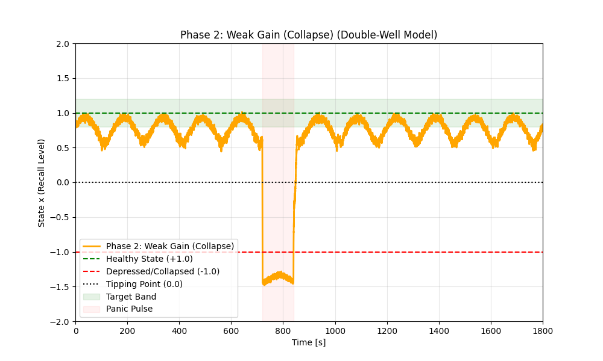

# 大事な時に「頭が真っ白」になるのを防ぎたい！

**誰にでもある「緊張して言葉が出ない…」という瞬間。**
それを気合ではなく、**機械（AI）の力で科学的に守る**研究をしています。

## 1. どんな仕組み？
心には**「安心のお椀」**と**「パニックの谷」**があります。

- **元気な時**: お椀が深くて安心 😌
- **緊張した時**: お椀が浅くなり、ちょっとしたことで**地獄の谷**へ転がり落ちる 😱 $\to$ **これが「頭真っ白」状態**

### ✨ 解決策: 「心のエアバッグ」
AIが心拍数などを見守り、**谷に落ちそうな瞬間だけ**そっと支えます（スマートウォッチの優しい振動など）。
**「自転車の補助輪」**のように、ふらついた時だけ助けてくれます。

## 2. 実験でわかったこと
わざと意地悪な質問をして、パニックになるか試しました。

  

    
    <small>❌ 助けがないと そのままパニック...</small>
  

  

    
    <small>⭕️ <strong>エアバッグあり</strong> すぐに持ち直せる！</small>
  

<strong>家族へのメッセージ:</strong> 
「失敗したらどうしよう」という不安をなくして、誰もが安心して頑張れる未来を作りたいです。

